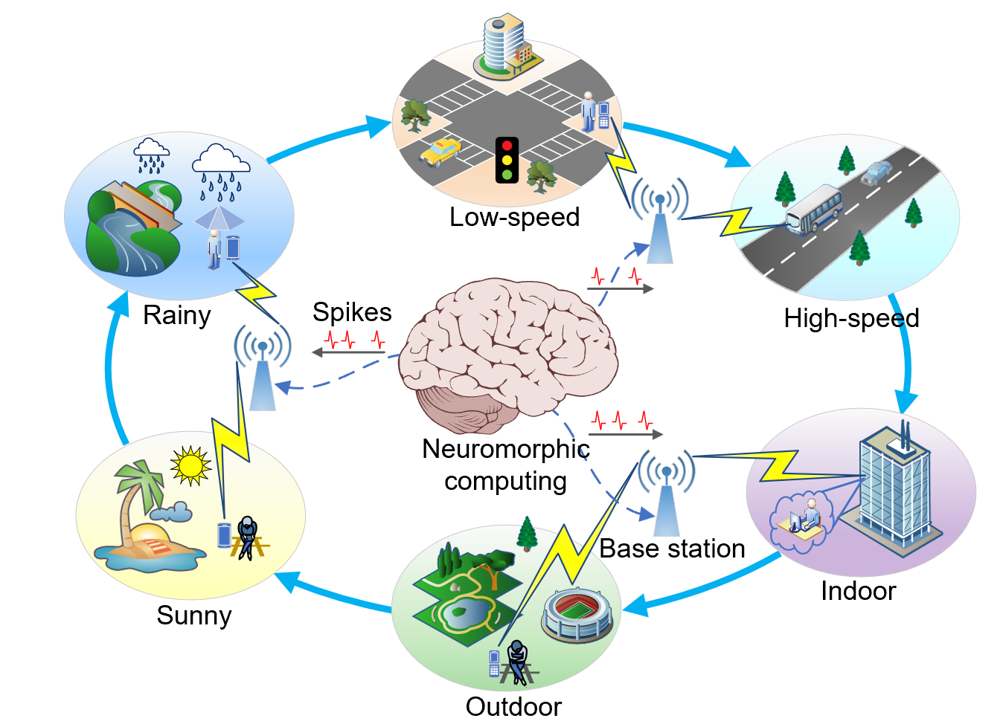

# SpikACom: A Neuromorphic Computing Framework for Green Wireless Communication

This repository contains the simulation code for the paper:  
**"SpikACom: A Neuromorphic Computing Framework for Green Wireless Communication."**

## Table of Contents
- [Introduction](#introduction)
- [Dependencies](#dependencies)
- [Use Instruction](#use-instruction)
- [License](#license)
- [Citation](#citation)
  
## Introduction

SpikACom is a neuromorphic computing framework designed to enable energy-efficient and adaptive communication by leveraging spiking neural networks (SNNs). It is <u>optimized for</u> dynamic wireless environments, which can</u> efficiently adapt to new channel distributions with significantly <u>reduced</u> catastrophic forgetting. This repository provides the simulation code used in our paper to evaluate its performance in three representative communication scenarios: <u>task-oriented semantic communication, MIMO beamforming,</u> and OFDM channel estimation.
<p align="center">
  
</p>

## Dependencies

The code has been tested in the following environment:

- **Python** = 3.10.13  
- **SpikingJelly** = 0.0.0.0.14  
- **NumPy** = 1.24.3  
- **SciPy** = 1.15.1  
- **h5py** = 3.5.0  

To install the required dependencies, run:

```sh
pip install spikingjelly==0.0.0.0.14 numpy==1.24.3 scipy==1.15.1 h5py==3.5.0
```

Or create a virtual environment:

```sh
python -m venv env
source env/bin/activate  # On Windows use: env\Scripts\activate
pip install spikingjelly==0.0.0.0.14 numpy==1.24.3 scipy==1.15.1 h5py==3.5.0
```

## Use Instruction

### 🔥 Task-Oriented Semantic Communications

---

### 📁 Project Structure

```
Task oriented semantic communications/
├── data/
│   └── download/             # Place all 4 DVS128 dataset files here
├── train.py                  # Main script including dataset processing, SNN training, and continual learning
├── model.py                  # SNN models
├── ...                       # Other scripts
```

---

### 📥 Dataset Preparation

1. Download the **DVS128 Gesture dataset** (4 files) from:

   🔗 https://ibm.ent.box.com/s/3hiq58ww1pbbjrinh367ykfdf60xsfm8/folder/50167556794

2. Place **all 4 downloaded files** into the directory:

   ```
   ./data/download/
   ```

---

### 🚀 Run the Demo

To launch the full pipeline:

```bash
python train.py
```

### ✅ What the script does:

1. **Dataset Processing**
   - Uses [SpikingJelly](https://spikingjelly.readthedocs.io/zh-cn/latest/activation_based_en/neuromorphic_datasets.html) to unpack and convert DVS event data into frames.
   - <u>Skips this step if processed data already exists.</u>  
   > ⚠️ Note: The first-time preprocessing may take **30–50 minutes**.

2. **Spiking CNN Training**
   - Trains a spiking convolutional neural network for gesture recognition.  
   - Extracts and stores convolutional (semantic) features into the folder `./saved_features` <u>to save time in the continual learning stage</u>.  
   > ⚠️ Note: The script checks whether intermediate files already exist. If they do, training steps will be skipped.  
   > <u>If execution is interrupted by error, try deleting the generated files manually to restart</u>: `Initial_max.pth` and `./saved_features`.

3. **Continual Learning with SpikACom**
   - Runs the SpikACom framework across dynamic environments with different PDPs.
   - Tracks the model’s performance over time to show the learning trajectory (against catastrophic forgetting).

---

### 🔥 MIMO Beamforming

This folder contains the basic code for SNN-based MIMO beamforming. For convenience, the script uses <u>a Rayleigh fading MIMO channel</u>, so it is self-contained and can be run with:

```bash
python train.py
```

You can also test performance on more complex ray-tracing models like [DeepMIMO](https://www.deepmimo.net).  
In addition, a <u>parallel WMMSE solver</u> is implemented for fast baseline comparison.

---

### 🔥 OFDM Channel Estimation

This folder contains the basic code for SNN-based OFDM channel estimation, where you can generate the channel dataset by using the WINNER II channel model in [MATLAB Communication Toolbox](https://www.mathworks.com/help/comm/ug/winner-ii-channel.html).  

---

## License

This project is licensed under the MIT License. See the `LICENSE` file for details.

- 📄 Paper Link: [https://arxiv.org/abs/2502.17168](https://arxiv.org/abs/2502.17168)

---

## Citation
We appreciate your interest in this work and welcome your feedback!  
If you find this repository useful, please consider citing the following paper:

```bibtex
@article{liu2025spikacom,
  title={SpikACom: A Neuromorphic Computing Framework for Green Wireless Communications},
  author={Liu, Yanzhen and Qin, Zhijin and Zhu, Yongxu and Li, Geoffrey Ye},
  journal={arXiv preprint arXiv:2502.17168},
  year={2025}
}
```

